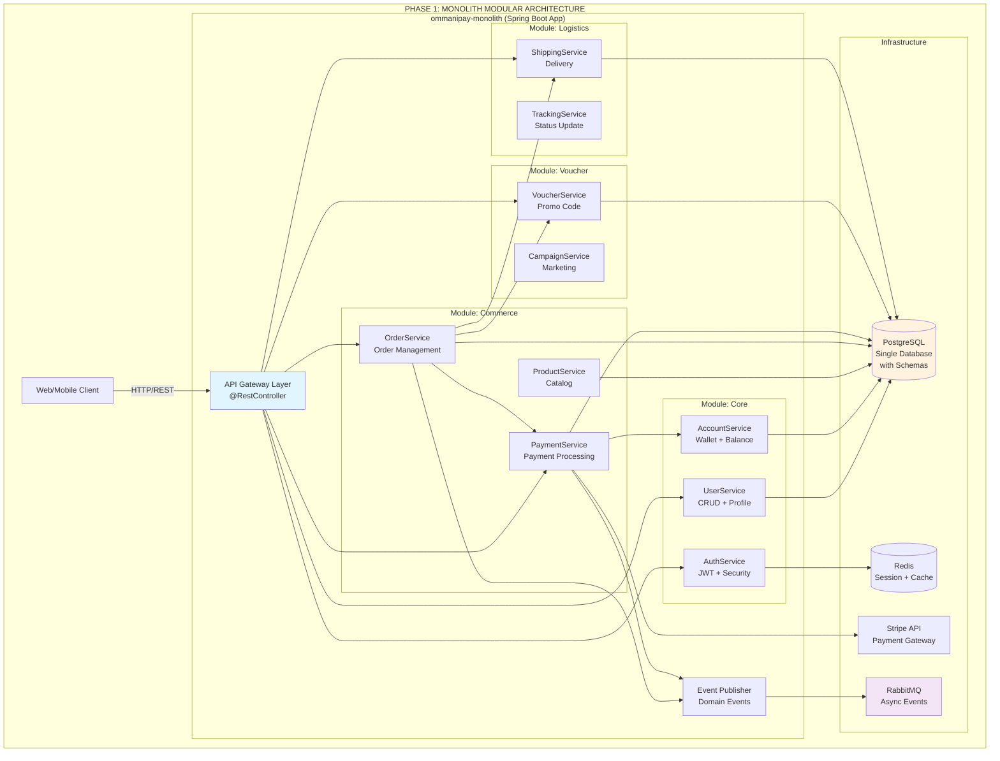

# Tổng quan
## 1. Giới thiệu
- Dự án: **Ommanipay — Nền tảng thanh toán tổng hợp**
- Mục tiêu: Xây dựng một hệ thống thanh toán có thể mở rộng, bắt đầu từ **kiến trúc monolith modular**.

---

## 2. Mục tiêu hệ thống
- Cung cấp API cho Web và Mobile.
- Hỗ trợ các tính năng: đăng nhập, nạp/rút ví, mua hàng, thanh toán Stripe, sử dụng voucher, và theo dõi đơn hàng.
- Thiết kế có thể tách thành microservices ở Phase 2.

---

## 3. Phạm vi hệ thống
Hệ thống chạy trong 1 Spring Boot App với nhiều module:
- Core (Auth, User, Account)
- Commerce (Product, Order, Payment)
- Voucher (Promotion, Campaign)
- Logistics (Shipping, Tracking)

Cấu trúc này được mô tả trong sơ đồ sau:

