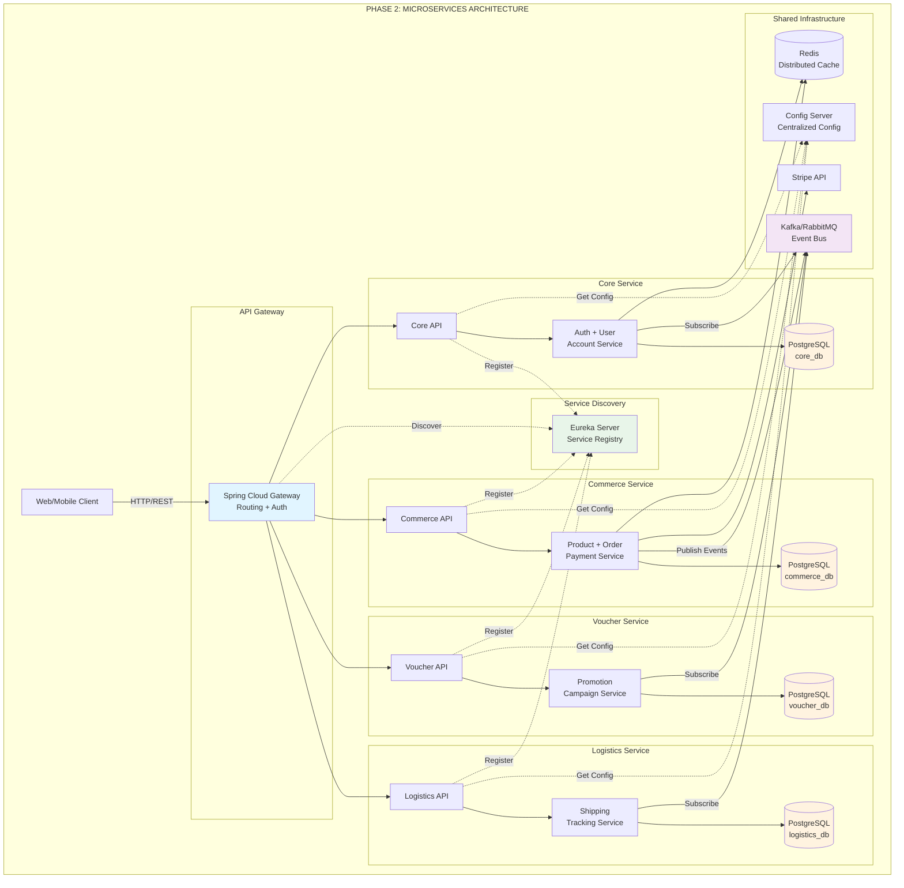

# Sơ đồ kiến trúc

```mermaid
graph TB
    subgraph "PHASE 2: MICROSERVICES ARCHITECTURE"
        Client2[Web/Mobile Client]
        
        subgraph "API Gateway"
            Gateway2[Spring Cloud Gateway<br/>Routing + Auth]
        end
        
        subgraph "Service Discovery"
            Eureka[Eureka Server<br/>Service Registry]
        end
        
        subgraph "Core Service"
            CoreAPI[Core API]
            CoreBiz[Auth + User<br/>Account Service]
            CoreDB[(PostgreSQL<br/>core_db)]
        end
        
        subgraph "Commerce Service"
            CommerceAPI[Commerce API]
            CommerceBiz[Product + Order<br/>Payment Service]
            CommerceDB[(PostgreSQL<br/>commerce_db)]
        end
        
        subgraph "Voucher Service"
            VoucherAPI[Voucher API]
            VoucherBiz[Promotion<br/>Campaign Service]
            VoucherDB[(PostgreSQL<br/>voucher_db)]
        end
        
        subgraph "Logistics Service"
            LogisticsAPI[Logistics API]
            LogisticsBiz[Shipping<br/>Tracking Service]
            LogisticsDB[(PostgreSQL<br/>logistics_db)]
        end
        
        subgraph "Shared Infrastructure"
            Cache2[(Redis<br/>Distributed Cache)]
            Queue2[Kafka/RabbitMQ<br/>Event Bus]
            Stripe2[Stripe API]
            ConfigServer[Config Server<br/>Centralized Config]
        end
        
        Client2 -->|HTTP/REST| Gateway2
        
        Gateway2 --> CoreAPI
        Gateway2 --> CommerceAPI
        Gateway2 --> VoucherAPI
        Gateway2 --> LogisticsAPI
        
        CoreAPI --> CoreBiz
        CommerceAPI --> CommerceBiz
        VoucherAPI --> VoucherBiz
        LogisticsAPI --> LogisticsBiz
        
        CoreBiz --> CoreDB
        CommerceBiz --> CommerceDB
        VoucherBiz --> VoucherDB
        LogisticsBiz --> LogisticsDB
        
        CoreAPI -.->|Register| Eureka
        CommerceAPI -.->|Register| Eureka
        VoucherAPI -.->|Register| Eureka
        LogisticsAPI -.->|Register| Eureka
        Gateway2 -.->|Discover| Eureka
        
        CoreAPI -.->|Get Config| ConfigServer
        CommerceAPI -.->|Get Config| ConfigServer
        VoucherAPI -.->|Get Config| ConfigServer
        LogisticsAPI -.->|Get Config| ConfigServer
        
        CoreBiz --> Cache2
        CommerceBiz --> Cache2
        
        CommerceBiz --> Stripe2
        
        CommerceBiz -->|Publish Events| Queue2
        VoucherBiz -->|Subscribe| Queue2
        LogisticsBiz -->|Subscribe| Queue2
        CoreBiz -->|Subscribe| Queue2
    end
    
    style Gateway2 fill:#e1f5ff
    style CoreDB fill:#fff3e0
    style CommerceDB fill:#fff3e0
    style VoucherDB fill:#fff3e0
    style LogisticsDB fill:#fff3e0
    style Queue2 fill:#f3e5f5
    style Eureka fill:#e8f5e9
```